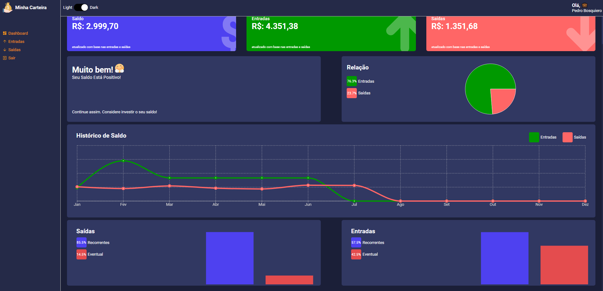

Front-End application to control (visually) user's money flow (income and outcome).

  

In this project i've used the following libraries (all opensource): 
- [**Recharts**](https://recharts.org/en-US) -> Graphics
- [**React CountUp**](https://www.npmjs.com/package/react-countup) -> Number Effects
